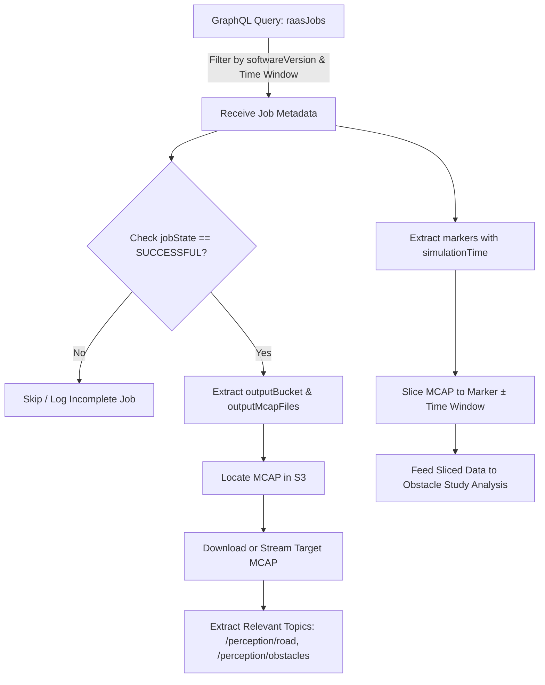

# Introduction

This document provides a field-by-field reference of the RaaS (Reprocessing as a Service) Job schema exposed by the [Marker Insight GraphQL v2 API](https://marker-insight.prod.aws.orionadp.com/api_v2/).

It directly supports:
- **Jira Issue:** [[ORIONINIT-211820] [LTMB] Gather and automate MCAP data extraction for obstacle study](https://jira.cc.bmwgroup.net/browse/ORIONINIT-211820)
- **Parent Epic:** [[ORIONINIT-213085] [LTMB] [2707] Redesign obstacle-based map invalidation model](https://jira.cc.bmwgroup.net/browse/ORIONINIT-213085)

The objective is to establish an exact understanding of query parameters, top-level attributes, linked markers, and output paths so that data extraction pipelines can systematically discover relevant reprocessing runs, filter by software version and evaluators, and retrieve the corresponding MCAP recording files for obstacle validation analysis.

---

# GraphQL Endpoint & Query Structure

- **Endpoint URL:** [Marker Insight GraphQL v2 API](https://marker-insight.prod.aws.orionadp.com/api_v2/)
- **Method:** `POST` (`Content-Type: application/json`)
- **Root Query Field:** `raasJobs`
- **Return Type:** `[RaasJob!]!` (returns an unpaginated array of job objects)

The entity relationships and schema structure are illustrated in the GraphQL Schema Diagram, which should be added to Confluence as an attachment.

> **Important Usage Note on Result Limits:**
> Unlike the deprecated REST `/api/raasjobs/` endpoint, the GraphQL v2 `raasJobs` query does not expose client-side pagination parameters (such as `limit`, `offset`, `first`, or cursor arguments). Queries should always supply restrictive filters (such as `softwareVersion`, `startTriggeredDatetime`, and `endTriggeredDatetime`) to avoid unbounded payloads.

## Query Formatting and Structure

The browser-based GraphiQL query builder provides schema-aware completion and validation. A `raasJobs` query has three parts:

1. **Operation and variables:** Name the operation and declare typed inputs.
2. **Root field and filters:** Call `raasJobs` with filter arguments.
3. **Selection set:** List the attributes to return. Object and list fields need sub-selections.

> **Note:** GraphQL has no wildcard selections. Object fields such as `sessionInterval` and `markers` require sub-selections or the query fails validation.

<details>
<summary>Example GraphQL query for MCAP extraction</summary>

```graphql
query ExtractMcapJobs(
    # Variable Declaration
  $softwareVersions: [String!] = ["2707.0.0"]
  $startTime: String = "2026-09-01T00:00:00Z"
  $endTime: String = "2026-09-24T23:59:59Z"
) {
  raasJobs(
    # Filter arguments
    softwareVersion: $softwareVersions
    startTriggeredDatetime: $startTime
    endTriggeredDatetime: $endTime
    jobState: "SUCCESSFUL"
  ) {
    # Return attributes
    id
    jobState
    softwareVersion
    scenario
    rpuCommitHashOrion
    outputBucket
    jobOutputPath
    outputMcapFiles
    triggeredDatetime
    sessionInterval {
      session {
        id
      }
      intervalStartTimestamp
      intervalEndTimestamp
    }
    markers {
      id
      evaluator
      component
      markerType
      criticality
      simulationTime
      loggerTime
      description
      positionLat
      positionLon
    }
  }
}
```

</details>

---

# Query Arguments

> **Source:** Extracted from live GraphQL schema introspection of `Query.raasJobs.args` and `Query.markers.args` on the [Marker Insight GraphQL v2 API](https://marker-insight.prod.aws.orionadp.com/api_v2/).
>
> <details>
> <summary>Show the schema introspection query</summary>
>
> ```graphql
> query {
>   __type(name: "Query") {
>     fields {
>       name
>       args {
>         name
>         type {
>           kind
>           name
>           ofType {
>             kind
>             name
>             ofType {
>               kind
>               name
>             }
>           }
>         }
>       }
>     }
>   }
> }
> ```
>
> </details>

## `raasJobs`

These arguments filter RaaS jobs:

| Argument | Type | Description | Study Relevance |
|---|---|---|---|
| `id` | `[String!]` | List of RaaS job IDs | Targets specific jobs by identifier |
| `softwareVersion` | `[String!]` | List of target software/AdMake versions | Primary filter to target specific software releases or builds under evaluation |
| `startTriggeredDatetime` | `String` | ISO 8601 start timestamp | Constrains the temporal search window |
| `endTriggeredDatetime` | `String` | ISO 8601 end timestamp | Upper bound for the temporal search window |
| `markersEvaluator` | `[String!]` | Evaluator names associated with markers | Filters for jobs containing markers emitted by specific evaluators |
| `jobState` | `String` | Lifecycle state (e.g., `SUCCESSFUL`, `FAILED`) | Ensures only finished and valid jobs are queried |
| `taskState` | `String` | Sub-task execution state | Filters by low-level task status |
| `scenario` | `[String!]` | List of test scenario names | Focuses data gathering on specific test suites or road layouts |
| `session` | `[String!]` | List of recording session IDs | Targets specific drive recordings |
| `sessionInterval` | `[String!]` | Session IDs with interval hash | Isolates exact drive sub-intervals |
| `intervals` | `[String!]` | List of interval specifications | Selects jobs associated with specific intervals |
| `intervalSetId` | `[String!]` | List of interval-set IDs | Selects jobs using specific interval sets |
| `intervalSetName` | `[String!]` | List of interval-set names | Selects jobs using named interval sets |
| `branch` | `[String!]` | Git branches used for the RPU build | Ensures evaluation against the correct development branch |
| `contextId` | `[String!]` | Context identifier strings | Correlates jobs across broader pipeline executions |
| `testSet` | `[String!]` | Test-set identifier | Selects specific test campaigns |
| `trigger` | `[String!]` | Job trigger source or identifier | Identifies automated CI vs manual triggers |
| `vehicleVin` | `[String!]` | Vehicle VIN | Filters by data collection vehicle |
| `sensorReproVersion` | `[String!]` | Sensor reprocessing pipeline version | Ensures sensor input consistency across jobs |
| `raasTags` | `String` | RaaS tag value | Selects jobs by tag |
| `rpuConfigId` | `[String!]` | RPU configuration IDs | Selects jobs using specific RPU configurations |
| `rpuType` | `[String!]` | RPU runner types | Selects jobs executed by specific RPU types |
| `playbackMode` | `String` | Replay mode (e.g. `replay`, `pbs`, `continuous`) | Verifies execution mode compatibility |
| `hasAnalysis` | `String` | Analysis-presence filter | Selects jobs according to whether they have an associated analysis |
| `analysisTags` | `[String!]` | Analysis tag values | Filters jobs by associated analysis tags |
| `analysisStatus` | `[String!]` | Analysis statuses | Filters jobs by associated analysis status |
| `analysisArchived` | `String` | Analysis archive-state filter | Selects jobs according to associated analysis archive state |
| `taskExitCode` | `String` | Task exit-code filter | Filters jobs by task exit status |
| `taskError` | `String` | Task error filter | Filters jobs by task error information |

## `markers`

The root `markers` query returns `[Marker!]!`. Its arguments filter markers directly or filter through their related RaaS jobs.

| Argument | Type | Description |
|---|---|---|
| `raasJobStartTriggeredDatetime` | `String` | Related job start time |
| `raasJobJobState` | `String` | Related job state |
| `raasJobEndTriggeredDatetime` | `String` | Related job end time |
| `raasJobId` | `[String!]` | Related job IDs |
| `raasJobTrigger` | `[String!]` | Related job trigger values |
| `raasJobContextId` | `[String!]` | Related job context IDs |
| `raasJobBranch` | `[String!]` | Related job branches |
| `raasJobSession` | `[String!]` | Related job session IDs |
| `raasJobScenario` | `[String!]` | Related job scenarios |
| `raasJobSessionInterval` | `[String!]` | Related job session intervals |
| `raasJobVehicleVin` | `[String!]` | Related job vehicle VINs |
| `raasJobTestSet` | `[String!]` | Related job test sets |
| `raasJobIntervals` | `[String!]` | Related job interval specifications |
| `raasJobSensorReproVersion` | `[String!]` | Related job sensor repro versions |
| `raasJobIntervalSetName` | `[String!]` | Related job interval-set names |
| `raasJobPlaybackMode` | `String` | Related job playback mode |
| `raasJobIntervalSetId` | `[String!]` | Related job interval-set IDs |
| `raasJobRaasTags` | `String` | Related job RaaS tag |
| `raasJobRpuConfigId` | `[String!]` | Related job RPU configuration IDs |
| `raasJobHasAnalysis` | `String` | Related job analysis-presence filter |
| `raasJobRpuType` | `[String!]` | Related job RPU types |
| `raasJobAnalysisTags` | `[String!]` | Related job analysis tags |
| `raasJobTaskState` | `String` | Related job task state |
| `raasJobAnalysisStatus` | `[String!]` | Related job analysis statuses |
| `raasJobTaskExitCode` | `String` | Related job task exit code |
| `raasJobAnalysisArchived` | `String` | Related job analysis archive state |
| `raasJobTaskError` | `String` | Related job task error |
| `raasJobMarkersEvaluator` | `[String!]` | Related job marker evaluators |
| `raasJobSoftwareVersion` | `[String!]` | Related job software versions |
| `markerType` | `String` | Marker type |
| `criticality` | `[String!]` | Marker criticality values |
| `evaluator` | `[String!]` | Marker evaluators |
| `component` | `[String!]` | Marker components |
| `description` | `String` | Marker description |
| `markerHasAnalysis` | `String` | Marker analysis-presence filter |
| `descriptionAddition` | `String` | Marker description addition |
| `markerAnalysisTags` | `[String!]` | Marker analysis tags |
| `markerDetails` | `String` | Marker details |
| `markerAnalysisStatus` | `String` | Marker analysis status |
| `markerMetadata` | `String` | Marker metadata |
| `markerAnalysisArchived` | `String` | Marker analysis archive state |
| `markerId` | `BigInt` | Marker ID |

---

# Entity Attributes

## `RaasJob` (`raasJobs`)

The `RaasJob` object exposes execution metadata, artifact locations, linked records, and driving metrics. The table below lists every field in the live schema; GraphQL nullability and list wrappers are included in the types. `outputMcapFiles`, `jobOutputPath`, and `outputBucket` are the primary fields for discovering job artifacts.

| Field | GraphQL Type | Description |
|---|---|---|
| `id` | `String!` | Unique RaaS job identifier |
| `jobState` | `String!` | Overall job lifecycle state |
| `contextId` | `String!` | Pipeline context identifier |
| `sessionInterval` | `SessionInterval!` | Associated recording session and interval |
| `rpus` | `JSON!` | RPU execution data |
| `jobOutputPath` | `String!` | Path to job output artifacts |
| `rpuFailures` | `[RpuFailure!]!` | Linked RPU failure records |
| `relatedAnalyses` | `[RelatedAnalysis!]!` | Related analysis records |
| `analyses` | `[Analysis!]!` | Analysis records linked to the job |
| `scenario` | `String!` | Evaluated scenario identifier |
| `raasTags` | `JSON!` | Tags associated with the job |
| `branch` | `String!` | Source branch used for the job |
| `testSet` | `String!` | Test-set identifier |
| `intervals` | `String!` | Interval specifications |
| `intervalSetId` | `String!` | Interval-set identifier |
| `intervalSetName` | `String!` | Interval-set name |
| `triggeredDatetime` | `Datetime!` | Time the job was triggered |
| `playbackMode` | `String!` | Playback mode used for the job |
| `taskState` | `String!` | Task execution state |
| `outputMcapFiles` | `JSON!` | Generated output MCAP file data |
| `variant` | `String!` | Job variant |
| `softwareVersion` | `String!` | Software version used for the job |
| `sessionStartBdc` | `Float` | Session start BDC value |
| `sessionEndBdc` | `Float` | Session end BDC value |
| `drivenDistance` | `Float` | Total driven distance |
| `drivenTime` | `Float` | Total driven time |
| `drivenDistanceHoo` | `Float` | Driven distance for HOO |
| `drivenTimeHoo` | `Float` | Driven time for HOO |
| `drivenDistanceLsa` | `Float` | Driven distance for LSA |
| `drivenTimeLsa` | `Float` | Driven time for LSA |
| `drivenDistanceChangeLaneAvailable` | `Float` | Distance with lane changes available |
| `drivenTimeChangeLaneAvailable` | `Float` | Time with lane changes available |
| `drivenDistanceXcc` | `Float` | Driven distance for XCC |
| `drivenTimeXcc` | `Float` | Driven time for XCC |
| `drivenDistanceShadowMode` | `Float` | Driven distance in shadow mode |
| `drivenTimeShadowMode` | `Float` | Driven time in shadow mode |
| `drivenDistanceOnMotorway` | `Float` | Driven distance on motorways |
| `drivenTimeOnMotorway` | `Float` | Driven time on motorways |
| `mapRegion` | `String!` | Map region used by the job |
| `mapVersion` | `Int` | Map version used by the job |
| `mapPath` | `String` | Path to the map data |
| `argoWorkflowNameReference` | `String!` | Referenced Argo workflow name |
| `retriggeredJobs` | `JSON!` | Retriggered job data |
| `reachedEvaluatorLimits` | `JSON!` | Evaluator limit results |
| `sensorReproVersion` | `String!` | Sensor reprocessing version |
| `trigger` | `String!` | Job trigger identifier |
| `parameterSet` | `String!` | Parameter-set identifier |
| `rpuConfigId` | `String!` | RPU configuration identifier |
| `rpuConfigChanges` | `JSON!` | RPU configuration changes |
| `rpuType` | `String!` | RPU runner type |
| `exitCode` | `Int!` | RPU process exit code |
| `outputBucket` | `String!` | Bucket containing job artifacts |
| `inputJson` | `JSON!` | RPU input data |
| `executionArguments` | `JSON!` | RPU execution arguments |
| `realTimeFactor` | `Float` | Execution speed relative to real time |
| `rpuId` | `String!` | RPU identifier |
| `rpuBuildTime` | `Datetime!` | RPU build time |
| `rpuBaseBranch` | `String!` | RPU base branch |
| `rpuBoardnetVersion` | `String!` | RPU Boardnet version |
| `rpuPdxVersion` | `String!` | RPU PDX version |
| `rpuCommitHashDdad` | `String!` | DDAD source commit hash |
| `rpuCommitHashOrion` | `String!` | Orion source commit hash |
| `rpuMlPlannerEmilnetModelVersion` | `String!` | EmilNet ML Planner model version |
| `rpuMlPlannerQuadModelVersion` | `String!` | Quad ML Planner model version |
| `rpuTypeLlp` | `String!` | Low-level perception RPU type |
| `taskStateLlp` | `String!` | Low-level perception task state |
| `exitCodeLlp` | `Int!` | Low-level perception process exit code |
| `outputBucketLlp` | `String!` | Bucket containing low-level perception outputs |
| `inputJsonLlp` | `JSON!` | Low-level perception input data |
| `variantLlp` | `String!` | Low-level perception job variant |
| `softwareVersionLlp` | `String!` | Low-level perception software version |
| `executionArgumentsLlp` | `JSON!` | Low-level perception execution arguments |
| `realTimeFactorLlp` | `Float` | Low-level perception speed relative to real time |
| `rpuBuildTimeLlp` | `Datetime!` | Low-level perception RPU build time |
| `rpuBaseBranchLlp` | `String!` | Low-level perception RPU base branch |
| `rpuPdxVersionLlp` | `String!` | Low-level perception PDX version |
| `rpuCommitHashDdadLlp` | `String!` | Low-level perception DDAD commit hash |
| `rpuCommitHashOrionLlp` | `String!` | Low-level perception Orion commit hash |
| `runningEvaluators` | `JSON!` | Evaluators running in the RPU |
| `runningEvaluatorsLlp` | `JSON!` | Evaluators running in low-level perception |
| `createdDatetime` | `Datetime!` | Time the job record was created |
| `modifiedDatetime` | `Datetime!` | Time the job record was last modified |
| `rpHash` | `String!` | Reprocessing pipeline hash |
| `rpHashLlp` | `String!` | Low-level perception pipeline hash |
| `reprocessingQualityCheckState` | `String!` | Reprocessing quality-check state |
| `coredumps` | `[RpuFailure!]!` | Coredump failure records |
| `exceptions` | `[RpuFailure!]!` | Exception failure records |
| `stacktraces` | `[RpuFailure!]!` | Stack-trace failure records |
| `fpuExceptions` | `[RpuFailure!]!` | FPU exception records |
| `rpuErrors` | `[RpuFailure!]!` | RPU error records |
| `markers` | `[BaseMarker!]!` | Markers linked to the job |

## `Marker` (`markers`)

The root `markers` query returns `[Marker!]!`. It includes the marker fields below and a link to its RaaS job.

| Field | GraphQL Type | Description |
|---|---|---|
| `id` | `BigInt!` | Unique marker ID |
| `loggerTime` | `Duration!` | Elapsed vehicle logger time |
| `time` | `Datetime!` | UTC timestamp of the marker event |
| `simulationTime` | `Duration!` | Elapsed simulation time from run start |
| `evaluator` | `String!` | Name of the evaluator that raised the marker |
| `criticality` | `String!` | Severity level of the marker |
| `component` | `String!` | Subsystem component that produced the marker |
| `description` | `String!` | Human-readable event description |
| `descriptionAddition` | `JSON!` | Additional structured event details |
| `markerType` | `String!` | Functional classification of the marker |
| `source` | `String!` | Marker source identifier |
| `positionLat` | `Float!` | Latitude coordinate of the event |
| `positionLon` | `Float!` | Longitude coordinate of the event |
| `position0Digits` | `BigInt!` | Position coordinate component at precision 0 |
| `position1Digits` | `BigInt!` | Position coordinate component at precision 1 |
| `position2Digits` | `BigInt!` | Position coordinate component at precision 2 |
| `position3Digits` | `BigInt!` | Position coordinate component at precision 3 |
| `position4Digits` | `BigInt!` | Position coordinate component at precision 4 |
| `markerMetadata` | `[MarkerMetadataKey!]!` | Structured marker metadata keys |
| `markerMetadataNegative` | `[MarkerMetadataKey!]!` | Structured negative marker metadata keys |
| `analyses` | `[Analysis!]!` | Analyses linked to the marker |
| `raasJob` | `BaseRaasJob!` | Related RaaS job |

---

# Related Entities: Failures & Analyses

## `rpuFailures` & Error Lists (`[RpuFailure!]!`)

The job tracks crashes and system exceptions across categories (`coredumps`, `exceptions`, `stacktraces`, `fpuExceptions`, `rpuErrors`):

| Field | Type | Description |
|---|---|---|
| `id` | `ID!` | Unique failure record ID |
| `failureType` | `String!` | Category of the failure (e.g., `exception`, `coredump`) |
| `content` | `String!` | Raw stack trace or error log |
| `rpuType` | `String!` | Which RPU container failed |
| `cleanedRpuFailure` | `CleanedRpuFailure!` | Sanitized / aggregated error representation |

## `analyses` (`[Analysis!]!`)

Manual or automated investigations linked to the job:

| Field | Type | Description |
|---|---|---|
| `id` | `BigInt!` | Analysis record ID |
| `description` | `String!` | Summary of the finding |
| `descriptionDetailed` | `String!` | Detailed investigation notes |
| `status` | `String!` | State (`open`, `resolved`, `wontfix`, etc.) |
| `archived` | `Boolean!` | Whether the analysis has been archived |
| `createdDatetime` | `Datetime!` | Time when the analysis was created |
| `modifiedDatetime` | `Datetime!` | Time when the analysis was last modified |
| `tags` | `[AnalysisTag!]!` | Categorization tags with name and color |
| `urls` | `Dict!` | Links to Jira tickets, Confluence pages, or dashboards |

---

# MCAP Extraction Workflow



TODO: update workflow
